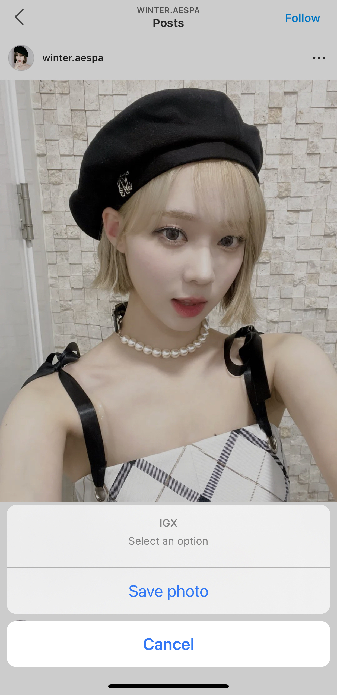
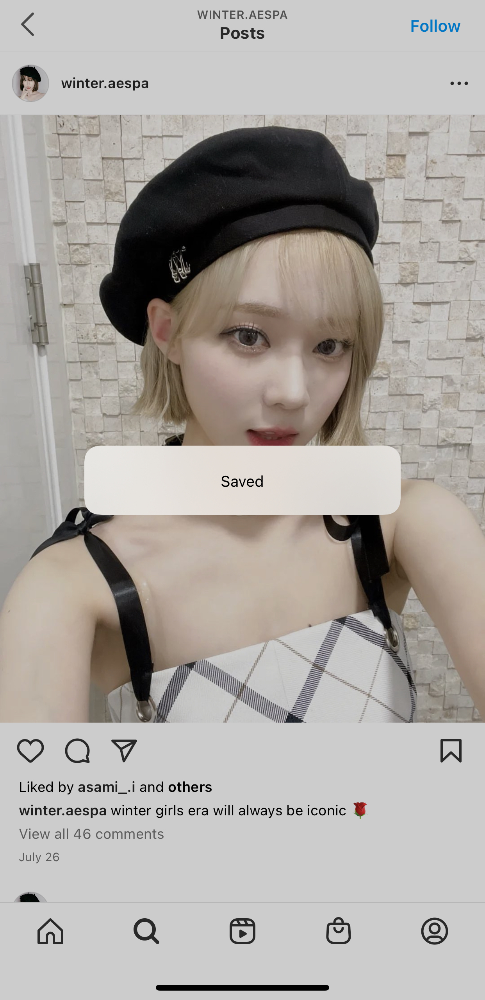
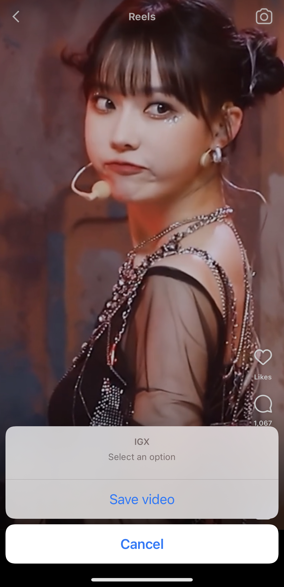
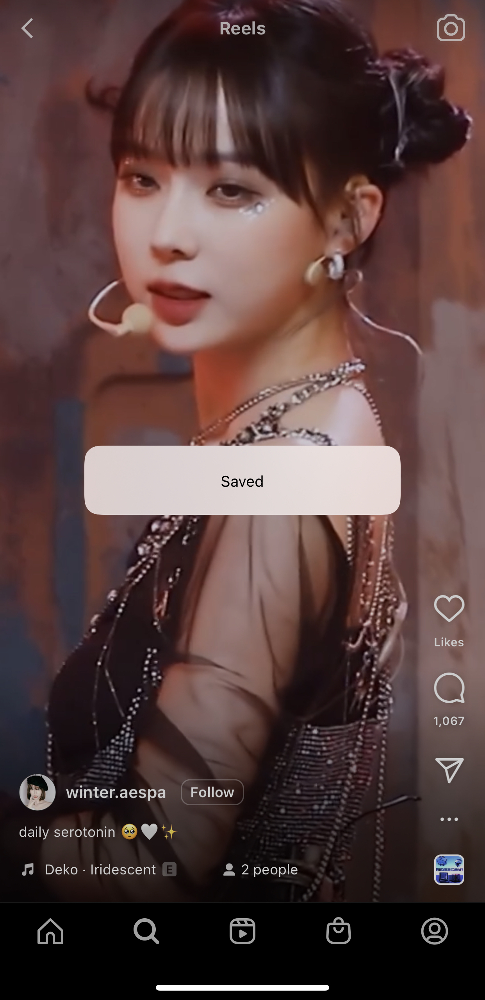

<div align="center">
<h1>IGX</h1>
<b>A simple tweak to save Instagram media</b>
</div>

## Features
- Press and hold the media to save it to the Photos app

## Supported media
- [x] Images
- [x] Reels (Videos)
- [x] Stories

## Compatibility
- iOS 14 or higher
- Latest version of Instagram

Tested on
- iOS 14.3
- Instagram version 262.0

## Build
Using Theos
```bash
make package FINALPACKAGE=1
```

## Screenshots
<div align="center">
    <kbd></kbd>
    <kbd></kbd>
    <kbd></kbd>
    <kbd></kbd>
</div>
